  
  
  
  

<!--DATE_START-->

  

<!--DATE_END-->

### 🚀 About Me

- 🎓 B.Tech Computer Science, **GLA University, Mathura** (2022 – 2026)
- 📊 Remote **Data Science Intern @ Krutanic Solutions** — built cleaning pipelines, ran EDA, shipped Power BI dashboards
- 🛠️ Full data stack: **ETL, SQL/PostgreSQL, Pandas, Scikit-learn, Power BI, GCP/BigQuery**
- 💻 Also build full-stack web apps (**React, Next.js, Node/Express, MongoDB**) and GenAI tools (**Gemini API**, prompt engineering, LLM integration)
- ⚡ Background in **IoT/embedded systems** (Arduino, sensors, home automation)
- 🎮 Off the clock: gaming and frame-by-frame animation are where the same problem-solving itch gets scratched
<!--STATUS_START-->
- 🌍 **Open to remote Data QA / Data Analytics / Data Science / Data Engineering roles** — available full-time now
<!--STATUS_END-->
- 📫 dhruvpratapsingh30.official2.o@gmail.com

### 🎮 Beyond the Code

---

### 🧰 Tech Stack

  
  
  
  
  
  
  
  
  
  
   
  
  
  
  
  
  
  
  
  
  
  
  
  
  
  

---

### 💼 Experience

**Data Science Intern — Krutanic Solutions** *(Remote, Aug 2025 – Nov 2025)*
- Automated data cleaning scripts (Python, Pandas, NumPy, SQL) that **cut data errors by ~30%**
- Ran EDA and statistical analysis to surface trends, anomalies, and KPIs across multiple domains
- Built and evaluated regression, classification, and time-series models with Scikit-learn
- Delivered stakeholder-facing dashboards in Power BI, Matplotlib, and Seaborn
- Automated end-to-end reporting pipelines, **cutting manual reporting effort by 40%**

---

### 📌 Featured Projects

<table>
  <tr>
    <td width="50%">
      <h4>🌦️ Weather Data Pipeline</h4>
      
Automated pipeline pulling real-time weather via REST API into PostgreSQL with incremental loads, dedup, and cron scheduling; time-series analysis on temperature/precipitation trends.

      <b>Stack:</b> Python, PostgreSQL, OpenWeather API, GCP, BigQuery
    </td>
    <td width="50%">
      <h4>🛒 E-commerce Analytics Pipeline</h4>
      
End-to-end pipeline transforming raw transactions into a star-schema data mart; automated KPI generation (revenue, AOV, churn, CLV) with Power BI dashboards and pre-load data quality gates.

      <b>Stack:</b> Python, SQL, BigQuery, GCP, Power BI
    </td>
  </tr>
  <tr>
    <td width="50%">
      <h4>📊 Vendor Performance Analysis</h4>
      
Unified purchase, sales, and logistics data into a vendor summary; EDA on sales trends, inventory turnover, and profit margins with automated KPI scripts.

      <b>Stack:</b> Python, SQL, Pandas, Seaborn 
      <a href="https://github.com/iamdpsingh/Vendor_Performance_Analysis">🔗 Repo</a>
    </td>
    <td width="50%">
      <h4>🏠 House Price Prediction</h4>
      
Random Forest + XGBoost regression on real estate data, <b>R² > 0.87</b>; feature engineering improved accuracy by ~12%. Deployed as a Flask REST API for real-time predictions.

      <b>Stack:</b> Python, Scikit-learn, XGBoost, Flask 
      <a href="https://github.com/iamdpsingh/House-Price-Prediction-Web-App">🔗 Repo</a>
    </td>
  </tr>
  <tr>
    <td width="50%">
      <h4>🎥 Zoomer — Video Conferencing App</h4>
      
Real-time video conferencing platform inspired by Zoom, with secure auth, meeting management, and live streaming.

      <b>Stack:</b> Next.js, TypeScript, Node.js, Clerk, ShadCN UI 
      <a href="https://github.com/iamdpsingh/Zoomer">🔗 Repo</a> · <a href="https://zoomer-dps-gauram.vercel.app/">🌐 Live Demo</a>
    </td>
    <td width="50%">
      <h4>🤖 AI Chatbot with Gemini API</h4>
      
Conversational AI chatbot using Gemini (gemini-1.5-flash) with multi-turn dialogue and context management via prompt engineering; interactive Streamlit frontend for real-time interaction.

      <b>Stack:</b> Python, Google Gemini API, Streamlit 
      <a href="https://github.com/iamdpsingh/AI5-chatbot-gemini">🔗 Repo</a>
    </td>
  </tr>
</table>

<b>🔩 Earlier IoT / Hardware Projects</b>

 

- **Smart Cane for Visually Impaired** — obstacle detection, haptic + audio feedback, GPS tracking, GSM alerts (Arduino, Raspberry Pi 3)
- **Home Automation System** — servo + ultrasonic sensors, RGB lighting, and TV automation for energy efficiency
- **Fabrication of a Room Heater with Controlled Humidification** — automated temperature/humidity regulation (Arduino, DHT11)

---

### 🏆 GitHub Trophies

  

### 📈 GitHub Stats

  
  

  

### 🐍 Contribution Snake

<picture>
  <source media="(prefers-color-scheme: dark)" srcset="https://raw.githubusercontent.com/iamdpsingh/iamdpsingh/output/github-contribution-grid-snake-dark.svg" />
  <source media="(prefers-color-scheme: light)" srcset="https://raw.githubusercontent.com/iamdpsingh/iamdpsingh/output/github-contribution-grid-snake.svg" />
  
</picture>

---

### 🎓 Education

| Institution | Qualification | Score | Year |
|---|---|---|---|
| GLA University, Mathura | B.Tech, Computer Science | CGPA 6.96/10 | 2022 – 2026 |
| Agra Vanasthali Vidyalaya, Agra | Intermediate (Class XII) | 70.6% | 2022 |
| Christ The King High School, Tundla | High School (Class X) | 83% | 2020 |

---

### 🏅 Certifications

**Infosys Springboard**
- Basics of Python — Python fundamentals
- Programming Fundamentals using Python — Python programming basics

**NPTEL**
- E-Business — E-business and online commerce
- Management Information System — MIS and its applications
- Software Engineering — Software development methodologies
- Ethics in Engineering Practice — Engineering ethics and professional conduct

**GLA CSED (Computer Science & Engineering Dept.)**
- Introduction to IoT — Internet of Things basics
- IIoT Communication & Standard Interface — Industrial IoT communication
- Smart Industrial Connectivity — Smart industry networks
- Data Science & Analytics — Data science and analytics
- Machine Learning for IIoT — ML applications in IIoT

**GLA University**
- Job Oriented Value Added Course — Job-oriented training program

**DataCamp**
- Introduction to R — 4-hour course, completed Apr 26, 2025

---

<!--FOOTER_STATUS_START-->

<i>🌍 Open to remote Data Analytics / Data Science / Data Engineering roles worldwide — available full-time now. Let's connect!</i>

<!--FOOTER_STATUS_END-->

