<!--
=========================================================
SYSTEM IDENTITY: DHRUV PRATAP SINGH
CLASS: DATA ENGINEER // CLOUD ARCHITECT
STATUS: ONLINE
=========================================================
-->

<div align="center">

<!-- HERO ANIMATION -->


<!-- SUBTITLE TYPING -->


<br/><br/>

<!-- SOCIAL MATRIX -->
<a href="https://www.linkedin.com/in/dhruvpratapsingh30/"></a>
<a href="https://dps-gauram-portfolio.netlify.app/"></a>
<a href="mailto:dhruvpratapsingh30.official2.o@gmail.com"></a>
<a href="https://www.instagram.com/iam_dpsingh/"></a>

</div>

<br/>

<!-- GLOWING DIVIDER -->


## ▓▒░ SYSTEM STATUS

```text
NAME       → Dhruv Pratap Singh
ROLE       → Data Engineer
MISSION    → Build scalable, high-performance data systems
FOCUS      → Cloud • ETL • ELT • Analytics
CURRENT    → Learning GCP • BigQuery • PySpark
STATUS     → ONLINE
```


## ▓▒░ ABOUT UNIT

I am a Data Engineer focusing on modern cloud data stacks. With a foundation in Computer Science and hands-on experience in full-stack development and data science, my primary mission is transforming raw data into scalable intelligence.

**🎓 BACKGROUND:** B.Tech Computer Science @ GLA University (2022–2026)  
**🔍 PREVIOUS XP:** Data Science Intern @ Krutanic Solutions (Remote)  
**⚡ CORE EXP:** Python • SQL • BigQuery • Pandas • Power BI  
**🌐 SECONDARY:** React • Next.js • GenAI • IoT Systems  

<br clear="both"/>


## ▓▒░ SKILL MATRIX

### ⚡ DATA ENGINEERING & CLOUD [PRIMARY]

<br/><br/>


### 📊 ANALYTICS & ML

<br/><br/>


### 🌐 DEVELOPMENT & TOOLS


## ▓▒░ CURRENT MISSION // 2026

```text
[██████████████████░░] 90% // GCP DATA STACK
[███████████████░░░░░] 75% // BIGQUERY ARCHITECTURE
[████████████░░░░░░░] 60% // PYSPARK PROCESSING
[███████████░░░░░░░░] 55% // AIRFLOW ORCHESTRATION
[████████░░░░░░░░░░░] 40% // KAFKA STREAMING
```


## ▓▒░ MISSION ARCHIVES [PROJECTS]

<table>
<tr>
<td width="50%" valign="top">

### 01 // E-commerce Analytics Pipeline
Cloud-native ELT pipeline processing **133M+ rows (16GB)** in under 30s. Extracted via GCE VMs to GCS, transformed in BigQuery star-schema. Output drives a Streamlit dashboard analyzing **1.9M orders** and **$628M revenue**.


[🔗 ACCESS DATABANK](https://github.com/iamdpsingh/Project-3--E-commerce-Analytics-Pipeline)

</td>
<td width="50%" valign="top">

### 02 // Weather Data Pipeline
Automated ingestion pipeline pulling real-time API weather data into PostgreSQL. Features incremental loads, deduplication, and cron scheduling for robust time-series analysis.


[🔗 ACCESS DATABANK](https://github.com/iamdpsingh/Project-2--Weather-Data-Pipeline)

</td>
</tr>
<tr>
<td width="50%" valign="top">

### 03 // Vendor Performance Analysis
Unified disparate purchase, sales, and logistics data sources to generate vendor summaries. Automated KPI scripts to perform EDA on sales trends and inventory turnover.


[🔗 ACCESS DATABANK](https://github.com/iamdpsingh/Vendor_Performance_Analysis)

</td>
<td width="50%" valign="top">

### 04 // AI Chatbot — Gemini API
Context-aware GenAI chatbot utilizing Gemini 1.5-flash. Engineered prompts for multi-turn dialogue state management with a real-time Streamlit UI.


[🔗 ACCESS DATABANK](https://github.com/iamdpsingh/AI5-chatbot-gemini)

</td>
</tr>
</table>

<details>
<summary><b>[+] DECRYPT SECONDARY MISSIONS</b></summary>
<br/>

- **Zoomer (Video Conferencing):** Real-time Next.js app with WebRTC, secure auth, and live streaming.
- **House Price Prediction:** Scikit-learn Random Forest/XGBoost model (R² > 0.87) deployed as a Flask REST API.
- **IoT Hardware:** Smart cane for the visually impaired (Arduino, haptics, GPS), Home automation.

</details>


## ▓▒░ TARGET DATA ARCHITECTURE

```mermaid
graph LR
    A([RAW DATA]) -.-> B[[INGESTION]]
    B ==> C[(GCS)]
    C ==> D[[TRANSFORMATION]]
    D ==> E[(BIGQUERY)]
    E -.-> F[STAR SCHEMA]
    F ==> G{{ANALYTICS}}
    G -.-> H[DASHBOARD]

    style A fill:#0A0A0F,stroke:#00D4FF,stroke-width:2px,color:#fff
    style B fill:#0A0A0F,stroke:#FF00FF,stroke-width:2px,color:#fff
    style C fill:#0A0A0F,stroke:#00D4FF,stroke-width:2px,color:#fff
    style D fill:#0A0A0F,stroke:#FF00FF,stroke-width:2px,color:#fff
    style E fill:#0A0A0F,stroke:#00D4FF,stroke-width:2px,color:#fff
    style F fill:#0A0A0F,stroke:#FF00FF,stroke-width:2px,color:#fff
    style G fill:#0A0A0F,stroke:#00D4FF,stroke-width:2px,color:#fff
    style H fill:#0A0A0F,stroke:#FF00FF,stroke-width:2px,color:#fff
```




## ▓▒░ EXPERIENCE LOG

**[ KRUTANIC SOLUTIONS ] // Data Science Intern (Remote)**
*Aug 2025 – Nov 2025*
- 🧹 Automated data cleaning pipelines (Python, SQL) → **Reduced errors by ~30%**.
- 🔍 Performed EDA & statistical modeling; delivered Power BI stakeholder dashboards.
- ⚙️ Automated reporting workflows → **Cut manual effort by 40%**.


## ▓▒░ CREDENTIALS

### EDUCATION
**GLA University, Mathura** // *B.Tech — Computer Science* (2022–2026) | CGPA 6.96/10

### SYSTEM CERTIFICATIONS
- **DataCamp:** Introduction to R
- **Infosys Springboard:** Python Programming Fundamentals
- **GLA CSED:** Data Science & Analytics, ML for IIoT, Intro to IoT
- **NPTEL:** Software Engineering, E-Business, MIS


## ▓▒░ GITHUB BATTLE STATS

<div align="center">

&nbsp;


</div>


## ▓▒░ ACTIVITY GRID

<div align="center">
<picture>
  <source media="(prefers-color-scheme: dark)" srcset="https://raw.githubusercontent.com/iamdpsingh/iamdpsingh/output/github-contribution-grid-snake-dark.svg" />
  <source media="(prefers-color-scheme: light)" srcset="https://raw.githubusercontent.com/iamdpsingh/iamdpsingh/output/github-contribution-grid-snake.svg" />
  
</picture>

> ⚡ **SYSTEM OVERRIDE:** Run [Actions](https://github.com/iamdpsingh/iamdpsingh/actions/workflows/snake.yml) to initiate contribution matrix generation.

<br/><br/>

</div>

<!-- FOOTER WAVE -->

